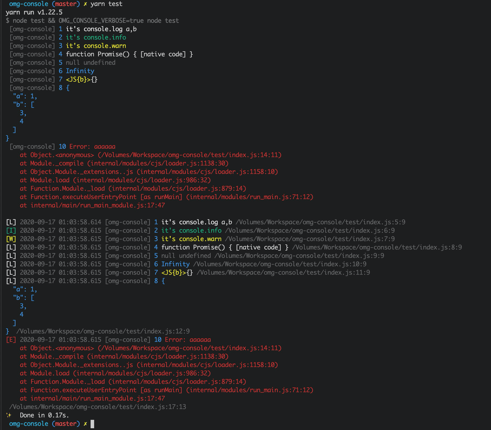

# omg-console

---

## 使用

```bash
npm install omg-console -save
```

```javascript
import Console from 'omg-console'
const console = new Console('my namespace')
console.log('hello world')
```

## Options

```javascript
new Console('my namespace')
new Console({name: 'xxx', verbose: true})
```

## 单例模式

```javascript
import { console } from 'omg-console'
console.log('xxx') // singleton

import { rawConsole } from 'omg-console'
rawConsole // original global.console
```

## 全局调试
```bash
# 全局环境变量
export OMG_CONSOLE_VERBOSE=true
```

## 特性

* 全功能的 console 替代方案，支持所有原生 console 方法
* 常用方法颜色高亮
* 错误会走到 stderr 流
* 支持回溯到源码对应行
* 支持 sourcemap
